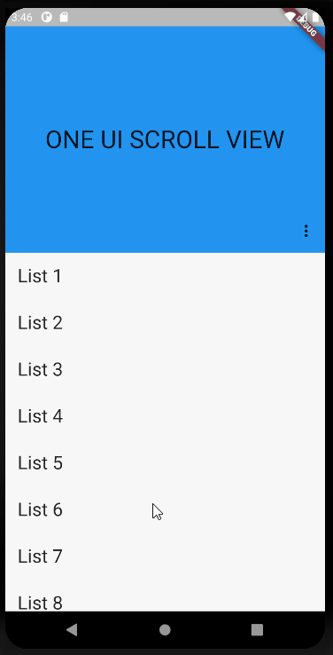

# One Ui Scroll View
 The CustomScrollView that work like expandable appBar at Samsung ONE UI.

# EXAMPLE


# HOW TO USE
- Here is sample code.

```dart 
import 'package:flutter/cupertino.dart';
import 'package:flutter/material.dart';
import 'package:flutter/rendering.dart';

import 'one_ui_scroll_view/one_ui_scroll_view.dart';

void main() => runApp(MyApp());

class MyApp extends StatelessWidget {
  @override
  Widget build(BuildContext context) {
    return MaterialApp(
      title: 'OneUiScrollViewDemo',
      home: ExamplePage(),
    );
  }
}

class ExamplePage extends StatelessWidget {
  @override
  Widget build(BuildContext context) {
    return Scaffold(
      body: OneUiScrollView(
        expandedTitle: Text('ONE UI SCROLL VIEW', style: TextStyle(fontSize: 32)),
        collapsedTitle: Text('Home', style: TextStyle(fontSize: 24)),
        actions: [
          IconButton(icon: const Icon(Icons.more_vert), onPressed: () {}),
        ],
        children: List<Widget>.generate(9, (index) {
          return Padding(
            padding: const EdgeInsets.all(16),
            child: Text(
              'List ${index + 1}',
              style: TextStyle(fontSize: 24),
            ),
          );
        }),
      ),
    );
  }
}
```
